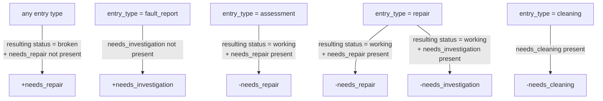

# SMEM — Repair Tracker

## Running the prototype

```
git clone <repo-url>
cd smem-repairs
python -m http.server
```

Then open http://localhost:8000

---

# Backend Specification

## 1. Overview

The Repair Tracker is an internal tool for a synthesiser museum to manage the lifecycle of instruments in the collection — from intake through assessment, repair, and display readiness. It replaces ad-hoc tracking in Airtable with a structured log-driven system.

### Core principles

- **The log is the source of truth.** Status and labels are derived from log entries, not stored as independent editable fields. Current state is always the result of the most recent relevant entry.
- **Status describes condition.** Not workflow, not intent — the physical/functional state of the instrument.
- **Labels describe outstanding actions.** They are additive signals that accumulate and must be explicitly dismissed.
- **Display readiness is computed.** Never set manually. It is a function of status, labels, and condition score.
- **Airtable is the instrument master.** The repair tracker syncs instrument identity from Airtable and writes status summaries back. It never owns instrument metadata.

---

## 2. System Architecture

### External systems

- **Airtable** is the master record for instrument identity (name, serial number, etc.). The repair tracker syncs instrument data from Airtable and writes repair status back.
- **Drupal** is the existing identity provider. The repair tracker should use it for authentication.
- **File storage** for attachments (photos, documents) needs to be decided — local disk, S3, Azure Blob, etc.

### Permissions

The backend returns a capabilities object on login. The frontend checks flags — it never derives permissions from roles. Permission rules live in one place (the backend).

| Action | Unauthenticated | Authenticated |
|---|---|---|
| View instruments (status + labels + location) | yes | yes |
| View full log history + scores | no | yes |
| Submit fault report | yes | yes |
| Create other log entry types | no | yes |
| Set status or labels on log entry | no | yes |
| Set location on log entry | no | yes |
| Edit log entry | no | yes |
| Delete log entry | no | yes |
| Trigger Airtable sync | no | yes |

**Fault report exception:** When an unauthenticated user submits a fault report, the backend computes and applies the inferred status and label changes server-side. The client cannot send arbitrary values — the backend overrides them with the inference result.

---

## 3. Data Model

### 3.1 `instrument`

Master record. Created and updated by Airtable sync. Never created manually.

```
instrument
├── id                uuid PK
├── airtable_id       text UNIQUE NOT NULL       -- Airtable record ID, sync key
├── display_name      text NOT NULL              -- e.g. "Moog Minimoog Model D"
├── serial_number     text NULLABLE              -- null if unknown or absent
└── last_synced_at    timestamptz NOT NULL
```

**Notes:**
- `status`, `condition_score`, and `location` are not stored here. They are computed from `log_entry` at query time (or cached via a materialised view).
- `display_name` is synced from Airtable and used for display without requiring an API call on every page load.
- `location` is not synced to Airtable — it is owned entirely by the repair tracker.

---

### 3.2 `log_entry`

The central entity. Every change to an instrument's condition, status, or labels is represented as a log entry. There is no separate audit table.

```
log_entry
├── id                uuid PK
├── instrument_id     uuid FK → instrument
├── contributor_id    uuid FK → contributor NULLABLE  -- null = unauthenticated visitor
├── performed_at      date NOT NULL
├── entry_type        enum NOT NULL              -- see Entry Types
├── notes             text NOT NULL
├── status            enum NULLABLE              -- only set when status changes
├── condition_score   int NULLABLE               -- 1–10, only set when score changes
├── location          text NULLABLE              -- only set when location changes
├── labels_added      text[] NOT NULL DEFAULT {} -- label keys added by this entry
└── labels_removed    text[] NOT NULL DEFAULT {} -- label keys removed by this entry
```

**Constraints:**
- `contributor_id` is resolved from the session by the backend — never sent by the client. Null means the entry was submitted by an unauthenticated visitor.
- `status` must only be set if it differs from the current instrument status (enforced in application layer).
- `condition_score` must only be set if it differs from the current score (enforced in application layer).
- `location` is a freeform string. Only set when the instrument moves. Current location is derived from the most recent log entry that set it.
- `labels_added` and `labels_removed` must not overlap.
- `labels_added` must not contain keys already present on the instrument.
- `labels_removed` must not contain keys not currently present on the instrument.

---

### 3.3 `attachment`

File attached to a log entry (photos, documents). A log entry can have zero or more attachments.

```
attachment
├── id                uuid PK
├── log_entry_id      uuid FK → log_entry
├── file_path         text NOT NULL               -- storage location (see architecture)
├── file_name         text NOT NULL               -- original upload name
├── mime_type         text NOT NULL
└── uploaded_at       timestamptz NOT NULL
```

---

### 3.4 `contributor`

Anyone who performs or is credited with work. May or may not have a system login.

```
contributor
├── id                uuid PK
├── drupal_user_id    text NULLABLE              -- null = not a Drupal user
├── name              text NOT NULL
└── contact           text NULLABLE
```

---

### 3.5 Enumerations

#### `entry_type`
```
fault_report | assessment | repair | cleaning | other
```

#### `instrument_status`
```
unknown | broken | working | retired | disposed
```

#### `label_key`
```
needs_repair | needs_investigation | needs_cleaning
```


---

### 3.6 Derived / computed values

These are never stored directly. They are always computed from the log.

#### Current status
```python
def get_current_status(instrument_id) -> instrument_status:
    entry = (
        log_entry
        .filter(instrument_id=instrument_id, status__not_null=True)
        .order_by('-performed_at', '-created_at')
        .first()
    )
    return entry.status if entry else 'unknown'
```

#### Current condition score
```python
def get_current_score(instrument_id) -> int | None:
    entry = (
        log_entry
        .filter(instrument_id=instrument_id, condition_score__not_null=True)
        .order_by('-performed_at', '-created_at')
        .first()
    )
    return entry.condition_score if entry else None
```

#### Current labels
```python
def get_current_labels(instrument_id) -> set[label_key]:
    entries = log_entry.filter(instrument_id=instrument_id).order_by('performed_at', 'created_at')
    labels = set()
    for entry in entries:
        labels.update(entry.labels_added)
        labels.difference_update(entry.labels_removed)
    return labels
```

#### Current location
```python
def get_current_location(instrument_id) -> str | None:
    entries = log_entry.filter(
        instrument_id=instrument_id, location__not_null=True
    ).order_by('-performed_at', '-created_at')
    entry = entries.first()
    return entry.location if entry else None
```

#### Display ready
```python
DISPLAY_READY_THRESHOLD = 7

def is_display_ready(instrument_id) -> bool:
    status = get_current_status(instrument_id)
    score  = get_current_score(instrument_id)
    labels = get_current_labels(instrument_id)
    return (
        status == 'working'
        and len(labels) == 0
        and score is not None
        and score >= DISPLAY_READY_THRESHOLD
    )
```

---

## 4. Status State Machine

Status describes the physical/functional condition of the instrument. It is set explicitly on a log entry and only recorded when it changes.

### Valid statuses

| Status | Meaning |
|---|---|
| `unknown` | Condition not yet assessed. Default for new instruments with no log entries. |
| `broken` | Known functional issues. |
| `working` | Functioning correctly. |
| `retired` | No longer active. Kept in storage or as a donor unit for parts. |
| `disposed` | No longer in the museum's possession. |

### Transition rules

`unknown` is the implicit initial state. It is never set explicitly on a log entry — it is the absence of any status entry. It cannot be set via the UI.

`retired` and `disposed` are terminal states. Log entries can still be made against these instruments, but the status field is locked — no log entry may change the status of a retired or disposed instrument.

### Inferred status transition

When a `fault_report` is submitted against a `working` instrument, the UI pre-fills the status as `unknown` (the instrument's condition is now uncertain). This can be overridden. No other entry type suggests a status change.

---

## 5. Label State Machine

Labels represent outstanding actions or attention signals. Multiple labels can be active simultaneously. Labels are added and removed via log entries and must be explicitly dismissed — they never clear automatically.

### Valid labels

| Label | Meaning |
|---|---|
| `needs_repair` | Known functional issue requiring repair work. |
| `needs_investigation` | Something has been reported but the cause is unknown. |
| `needs_cleaning` | Physical cleaning required. |

### Label inference rules

When a log entry is submitted, the system infers suggested label additions and removals based on entry type and the resulting status. Suggestions are pre-populated in the UI and can be accepted, modified, or overridden before submission.



### Full inference table

**Global rule (all entry types):**

| Resulting status | Condition | Label change |
|---|---|---|
| `broken` | `needs_repair` not present | suggest `+needs_repair` |

**Per entry type:**

| Entry type | Resulting status | Condition | Label change |
|---|---|---|---|
| `fault_report` | any | `needs_investigation` not present | suggest `+needs_investigation` |
| `assessment` | `working` | `needs_repair` present | suggest `-needs_repair` |
| `repair` | `working` | `needs_repair` present | suggest `-needs_repair` |
| `repair` | `working` | `needs_investigation` present | suggest `-needs_investigation` |
| `cleaning` | any | `needs_cleaning` present | suggest `-needs_cleaning` |

### Label dismissal

Labels can be dismissed at any time via a log entry (by setting `labels_removed`), regardless of entry type. Dismissal is always a human action — the system never removes a label without an explicit `labels_removed` entry.

---

## 6. Open Questions

1. **Condition score threshold** — currently hardcoded at 7. Should this be configurable per instrument (e.g. a fragile rare unit might be display-ready at 6)?
2. **Airtable deletion handling** — what happens when something is deleted from airtable?